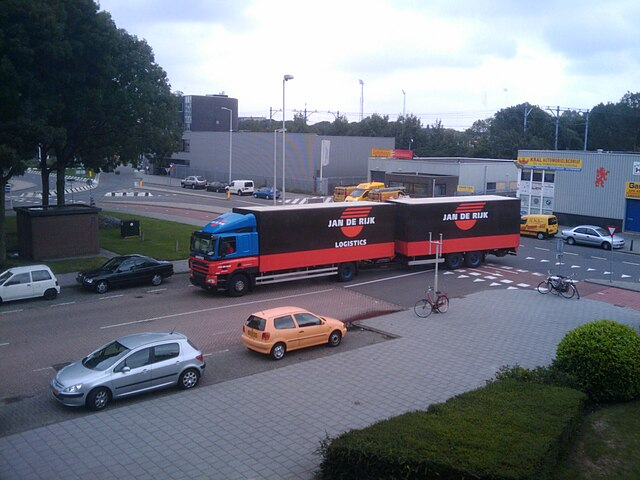

A simple rest service that accepts an image as post input and retuns
json with classification lables and x,y coordinates to draw a bounding box
This was built and tested on linux.  Use on other platforms will likely require changes


# Use
Follow typical python instructions to make a virutal environment and install the requirements
with pip install -r requirements.txt
Get a copy of the yolo model.  See classify.py for more information

In one terminal run the server.  The server requires ~700MB of free RAM to function.

```bash
python service.py
```


Post in images to get results.
```bash
cd example
.\runexample
```
Example output for image

```json
[
  {
    "class": "car",
    "confidence": 0.9113190770149231,
    "x1": 49,
    "y1": 329,
    "x2": 206,
    "y2": 410
  },
  {
    "class": "car",
    "confidence": 0.8697629570960999,
    "x1": 240,
    "y1": 305,
    "x2": 348,
    "y2": 359
  },
  {
    "class": "car",
    "confidence": 0.8362685441970825,
    "x1": 76,
    "y1": 253,
    "x2": 173,
    "y2": 292
  },
  {
    "class": "car",
    "confidence": 0.8105155825614929,
    "x1": 0,
    "y1": 263,
    "x2": 60,
    "y2": 302
  },
  {
    "class": "car",
    "confidence": 0.754155695438385,
    "x1": 565,
    "y1": 225,
    "x2": 615,
    "y2": 249
  },
  {
    "class": "truck",
    "confidence": 0.6131587624549866,
    "x1": 186,
    "y1": 194,
    "x2": 519,
    "y2": 295
  }
]
```

